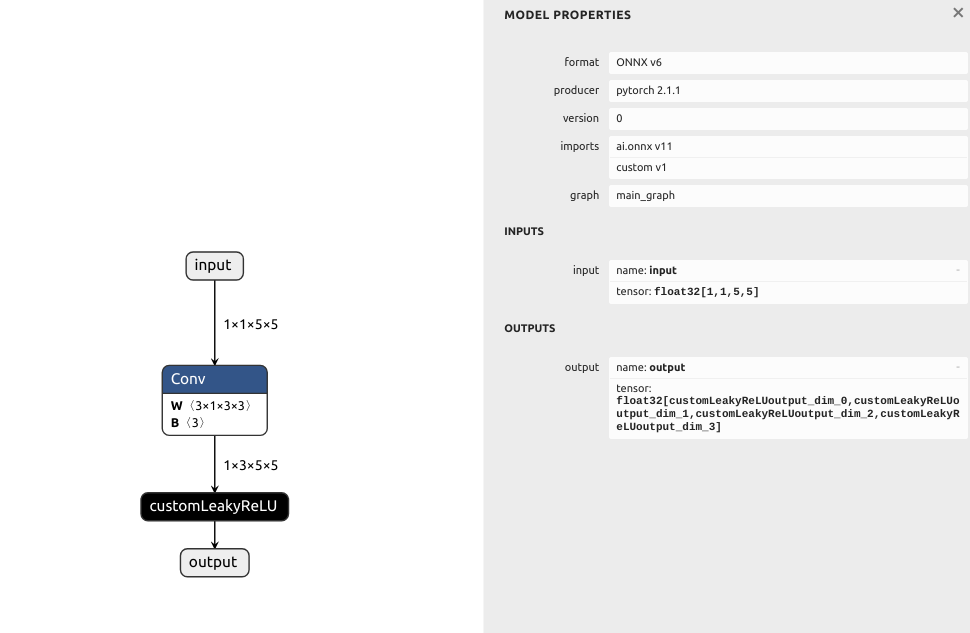

### generate model_with_customLeakyReLU.onnx by generate_model/generate_model.py.  

    tensor([[[[0.7576, 0.2793, 0.4031, 0.7347, 0.0293],
              [0.7999, 0.3971, 0.7544, 0.5695, 0.4388],
              [0.6387, 0.5247, 0.6826, 0.3051, 0.4635],
              [0.4550, 0.5725, 0.4980, 0.9371, 0.6556],
              [0.3138, 0.1980, 0.4162, 0.2843, 0.3398]]]])

    tensor([[[[ 0.0144, -0.0014, -0.0015,  0.0803,  0.2043],
              [ 0.0222, -0.0008,  0.3258, -0.0012,  0.1446],
              [ 0.0248,  0.1742,  0.0132, -0.0001,  0.1686],
              [ 0.2254,  0.2044, -0.0004,  0.1236,  0.1462],
              [ 0.4087,  0.2643,  0.5241,  0.3292,  0.0550]],
    
             [[-0.0070, -0.0084, -0.0062, -0.0072, -0.0049],
              [-0.0083, -0.0037, -0.0057, -0.0057, -0.0010],
              [-0.0082, -0.0034, -0.0084, -0.0034,  0.0986],
              [-0.0059, -0.0043, -0.0040, -0.0041, -0.0070],
              [-0.0051, -0.0025, -0.0027, -0.0035,  0.0796]],
    
             [[ 0.6817, -0.0009,  0.5281,  0.0318, -0.0000],
              [ 0.7087,  0.2333,  0.4918,  0.0873,  0.2097],
              [ 0.6584,  0.4132,  0.1523,  0.4054,  0.0703],
              [ 0.6568,  0.3064,  0.6330,  0.3827,  0.1644],
              [ 0.3768,  0.3999,  0.3990,  0.3953,  0.2430]]]],
           grad_fn=<CustomLeakyReLUImplBackward>)

### run test.

    input_dims: (nbDims = 4) 1 x 1 x 5 x 5
    output_dims: (nbDims = 4) 1 x 3 x 5 x 5
    
    >>>  = >>>
        0.757600	    0.279300	    0.403100	    0.734700	    0.029300	    0.799900	    0.397100	    0.754400	
        0.569500	    0.438800	    0.638700	    0.524700	    0.682600	    0.305100	    0.463500	    0.455000	
        0.572500	    0.498000	    0.937100	    0.655600	    0.313800	    0.198000	    0.416200	    0.284300	
        0.339800	
    <<< <<< <<<
    
    >>>  = >>>
        0.014380	   -0.001442	   -0.001466	    0.080312	    0.204325	    0.022175	   -0.000765	    0.325770	
       -0.001165	    0.144637	    0.024801	    0.174245	    0.013232	   -0.000143	    0.168570	    0.225415	
        0.204400	   -0.000431	    0.123601	    0.146177	    0.408733	    0.264284	    0.524106	    0.329217	
        0.055002	   -0.006989	   -0.008364	   -0.006165	   -0.007207	   -0.004902	   -0.008348	   -0.003741	
       -0.005698	   -0.005673	   -0.000986	   -0.008152	   -0.003366	   -0.008434	   -0.003386	    0.098569	
       -0.005858	   -0.004275	   -0.003964	   -0.004144	   -0.006986	   -0.005086	   -0.002544	   -0.002659	
       -0.003468	    0.079648	    0.681701	   -0.000916	    0.528082	    0.031835	   -0.000038	    0.708689	
        0.233341	    0.491843	    0.087281	    0.209678	    0.658435	    0.413162	    0.152312	    0.405359	
        0.070280	    0.656816	    0.306425	    0.633001	    0.382684	    0.164414	    0.376826	    0.399926	
        0.399028	    0.395284	    0.242954	
    <<< <<< <<<
